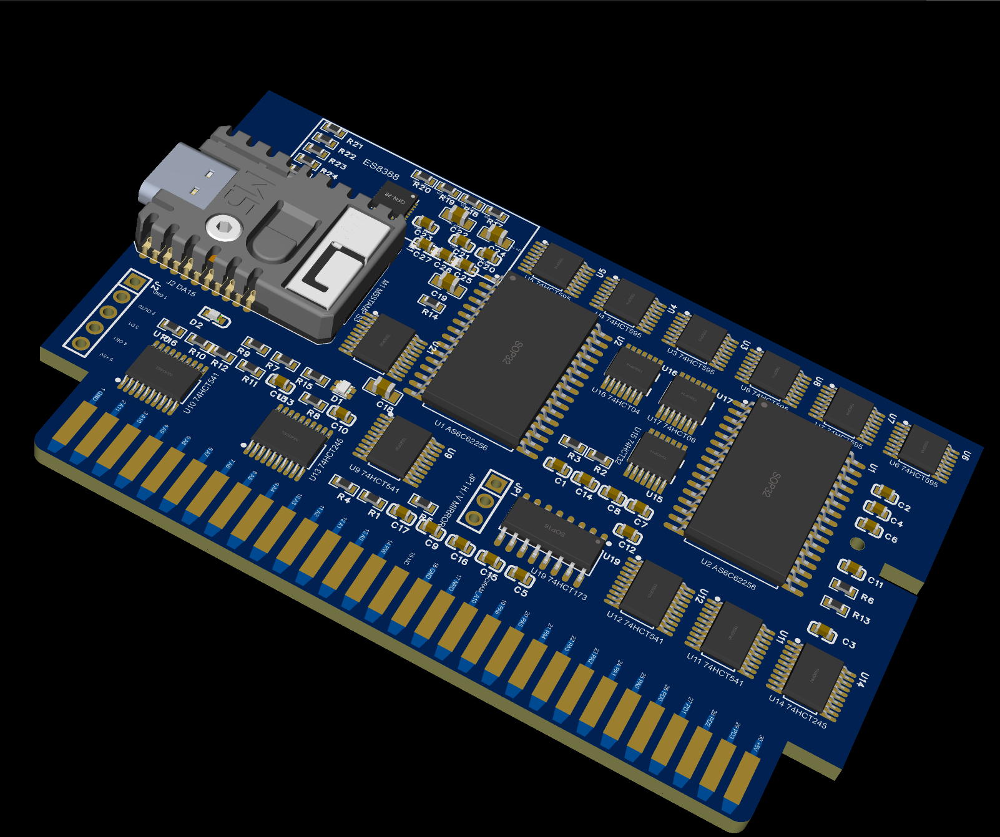

# Famicom ROM Cartridge (M5Stamp S3 + NROM/CNROM)

ファミコン実機で動作するカートリッジ基板。物理ROMの代わりに
**M5Stamp S3 (ESP32-S3)** を搭載し、電源投入時にROMイメージをSRAMへ
転送してファミコンにバスを明け渡す「SRAMロード&ハンドオーバー方式」を
採用しています。NROM/CNROMに対応し、PCM5102AによるI2S音声ミックスと
SLG46826G GreenPAKによるOPMレジスタ捕捉回路をオプション搭載できます。



## 使い方 (UX)

1. カートリッジを挿してファミコンの電源を入れる
2. ESP32がSRAMへROMをロード(約1秒、完了をステータスLEDで通知)
3. 本体の **RESETボタンを押す** → ゲーム起動

※カートリッジ端子にはカート側から操作できるリセット線が無いため、この手順が必要。

## 構成

- マッパー: **NROM / CNROM** (PRG 32KB、CHRは最大4バンク)
- ROM相当: M68AF127B SRAM ×2 (PRG/CHR)
- ロード経路: 74HCT595 シフトレジスタチェーン ×2
- バス分離: 74HCT541/245 バッファ、74HCT32 ゲーティング
- 音声: M5Stamp S3の3線I2S → PCM5102A → カートリッジ音声端子45/46へミックス（オプション、未実装でも動作）
- 拡張ロジック: SLG46826G GreenPAKをM5Stamp S3からI2Cで書き換え、OPMレジスタ書込みを捕捉
- 外形: 純正シェル互換の段付き外形（最大90×56.8mm、主要部90×46.1mm）、板厚1.2mm
- 60ピンエッジ: 全端子幅1.60mm、先端テーパー、垂直引き込み、挿入側左右角R1.524mm
- ケース: M5Stamp S3のUSB-C位置に合わせた開口付きSTLを収録

## 使用部品と役割

| Ref | 部品 | 数 | 役割 |
|---|---|---:|---|
| M1 | M5Stamp S3 (ESP32-S3) | 1 | `.nes`ファイルの保存・展開、SRAMへのROM転送、WiFi UI、BLEコントローラ処理を担当 |
| U1 | M68AF127B SRAM (128K×8) | 1 | CPUから読み出されるPRG-ROMデータを保持。A15/A16はLow固定で32KBを使用 |
| U2 | M68AF127B SRAM (128K×8) | 1 | PPUから読み出されるCHR-ROMデータを保持。A15/A16はLow固定、CNROM時は最大4バンクを使用 |
| U3–U8 | 74HCT595 | 6 | M5Stamp S3の少数GPIOを24bitのアドレス・データ信号へ展開し、LOAD時にPRG/CHR SRAMへ書き込む |
| U9–U12 | 74HCT541 | 4 | ファミコン側のCPU/PPUアドレス・制御バスをバッファし、LOAD時は本体とSRAMを切り離す |
| U13, U14 | 74HCT245 | 2 | PRG/CHRデータバスをバッファし、RUN時のみSRAMからファミコン本体へデータを出力 |
| U15 | 74HCT32 | 1 | `/ROMSEL`、`R/W`、PPU制御信号を組み合わせ、SRAMとデータバッファの出力許可信号を生成 |
| U16 | 74HCT04 | 1 | `MODE`や`R/W`などの制御信号を反転 |
| U19 | 74HCT173 | 1 | CNROMのCHRバンク番号を保持し、CHR SRAMのA13/A14を切り替える |
| U20 | PCM5102A | 1 | M5Stamp S3の3線I2Sをアナログ音声へ変換。L/Rを抵抗加算し、45/46番端子へミックスするオプション実装 |
| U21 | SLG46826G GreenPAK | 1 | OPM用メモリマップドI/Oの書込み捕捉。M5Stamp S3からI2Cでインシステム設定 |
| Q1, Q2 | BSS138 | 2 | GreenPAKの5V I2CとM5Stamp S3の3.3V I2Cを双方向レベル変換 |
| J2 | 5ピンコネクタ | 1 | ファミコン前面DA15拡張ポートとの接続用。OUT0、`/OE joy1`、Joypad D1を扱う |
| JP1 | 3パッド半田ジャンパ | 1 | CIRAM A10の接続先をPA10/PA11から選び、縦・横ミラーリングを設定 |
| D1, D2 | 0603 LED | 2 | 電源表示と、ROMロード完了・RESET操作のステータス表示 |
| R15, R16 | 330Ω | 2 | LEDの電流制限 |
| R1–R4 | 10kΩ/20kΩ | 4 | DA15からの5V入力信号をM5Stamp S3用の3.3Vへ分圧 |
| R（プルアップ/ダウン） | 10kΩ | 8 | 起動時やLOAD時のMODE、SRAM、バッファ制御信号を安全な状態に固定 |
| R（直列） | 33Ω | 4 | 74HCT595の高速シフト信号のリンギングとノイズを抑制 |
| C（パスコン） | 100nF | 17 | 各ICの電源ノイズを除去 |
| C（バルク） | 22µF + 10µF | 各1 | 5V入力とM5Stamp S3近傍の電源変動を吸収 |
| R26–R29 | 4.7kΩ | 4 | GreenPAK I2Cレベル変換回路の3.3V側・5V側プルアップ |
| C28 | 100nF | 1 | GreenPAKのVDD/VDD2デカップリング |
| 0Ω抵抗 | 0Ω | 2 | カートリッジ音声端子45–46とピン31電源接続のオプション設定 |
| 60ピン・エッジコネクタ | 硬質金推奨の基板端子 | 1 | 全端子同一幅、先端テーパー。CPU/PPUバス、電源、音声、CIRAM信号へ接続 |

ロジックICには、M5Stamp S3の3.3V出力を5V系で確実にHigh判定できる **74HCTシリーズ**を使用します（74HCシリーズへの置き換えは不可）。

### 秋月電子で購入できる部品

| 対象 | 秋月電子の商品 | 適合・注意事項 |
|---|---|---|
| U1, U2 | [M68AF127B SRAM 1Mbit（5個入）](https://akizukidenshi.com/catalog/g/g101634/) | SOP32、1.27mmピッチ、5V、55ns。本基板の採用品。在庫限り |
| M1 | [M5Stamp S3](https://akizukidenshi.com/catalog/g/g118194/) | 基板実装にはピンヘッダーまたはキャステレーション接続を使用 |
| J2 基板側 | [JST XH 5Pベース付ポスト B5B-XH-A](https://akizukidenshi.com/catalog/g/g112250/) | 2.5mmピッチ、スルーホール。現在のJ2フットプリントをこの寸法に合わせる |
| J2 ケーブル側 | [JST XH 5Pハウジング XHP-5](https://akizukidenshi.com/catalog/g/g112258/) | コンタクトまたはコンタクト付きコードが別途必要 |
| C（100nF） | [0.1µF 50V X8L 1608](https://akizukidenshi.com/catalog/g/g116143/) | 各ICのパスコンとして使用可能 |
| C（10µF） | [10µF 16V X5R 2012](https://akizukidenshi.com/catalog/g/g107542/) | M5Stamp S3近傍のバルクコンデンサとして使用可能 |
| C（22µF） | [22µF 25V X5R 2012](https://akizukidenshi.com/catalog/g/g108240/) | 5V入力のバルクコンデンサとして使用可能 |
| D1 | [緑色チップLED 1608 OSTG1608C1A](https://akizukidenshi.com/catalog/g/g106417/) | 極性とフットプリントのピン1方向を実装前に確認 |
| D2 | [赤色チップLED 1608 SML-E12V8WT86](https://akizukidenshi.com/catalog/g/g111879/) | 極性とフットプリントのピン1方向を実装前に確認 |
| R（10kΩ） | [チップ抵抗 1/10W 10kΩ 1608](https://akizukidenshi.com/catalog/g/g115029/) | プルアップ、プルダウン、分圧に使用可能。販売単位に注意 |
| R（20kΩ） | [チップ抵抗 1/10W 20kΩ 1608](https://akizukidenshi.com/catalog/g/g106203/) | DA15入力の分圧に使用可能。販売単位に注意 |
| R（330Ω） | [チップ抵抗 1/10W 330Ω 1608](https://akizukidenshi.com/catalog/g/g116125/) | LED電流制限に使用可能 |
| U21 | [SLG46826G GreenPAK](https://akizukidenshi.com/catalog/g/g118384/) | TSSOP-20。I2Cでインシステム設定可能 |

74HCT595、74HCT541、74HCT245、74HCT32、74HCT04、74HCT173については、基板の表面実装フットプリントに適合する秋月電子の商品を確認できていません。74HC/LV/VHC品は入力しきい値や動作条件が異なるため代用せず、HCT品をLCSCなどから調達します。

## 機能

- **WiFi転送**: softAP (`FC-CART`) + Web UI (`http://192.168.4.1/`) で .nes アップロード/ゲーム切替
- **Bluetoothコントローラ**: 拡張ポート(DA15)経由でパッド入力を注入(BLEパッド → Bluepad32 統合予定)。カートリッジ端子にはコントローラ信号が無いため J2→DA15 ケーブルを使用
- **I2S音声**: PCM5102AのBCK内蔵PLLを使い、MCLKなしのBCK/LRCK/DINで端子45/46へミックス
- **GreenPAK設定**: SLG46826GをI2C経由で更新し、OPMエミュレーション用レジスタ書込みを捕捉

## 現在の設計状態

EasyEDA Proの現行基板は `PCB2` です。部品配置、ケース用穴、USB-C開口、
60ピン端子のテーパーと左右下角Rを反映済みです。配線とDRCは作業中で、
現在のGerberは発注用の最終版ではありません。

## ファームウェア開発 (ESP-IDF)

```sh
cd firmware
idf.py set-target esp32s3
idf.py build flash monitor
```

## ディレクトリ

- `docs/` — アーキテクチャ設計、寸法、発注仕様
- `pcb/` — EasyEDA設計、基板資料、フットプリント、Gerber/BOM/座標データ、ケースSTL
- `firmware/` — ESP32-S3 ファームウェア (PlatformIO)

基板ファイルの構成は [pcb/README.md](pcb/README.md)、設計詳細は
[docs/architecture.md](docs/architecture.md) を参照。
